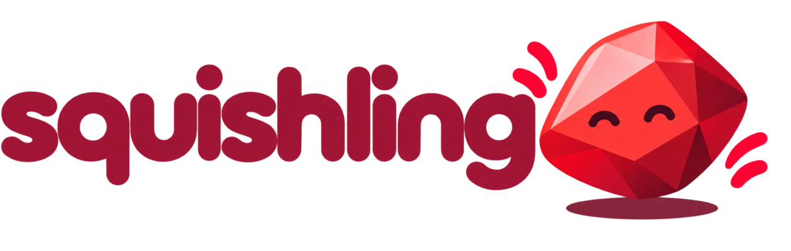
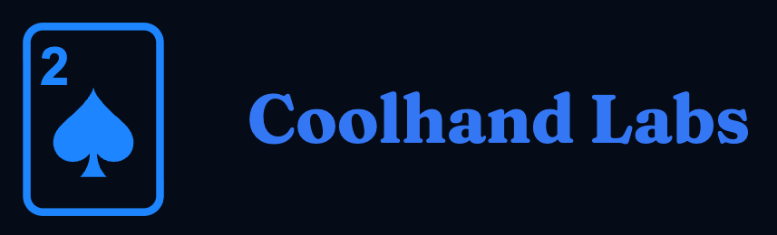

<h1 align="center">
  
</h1>

[](https://github.com/Coolhand-Labs/squishling/actions/workflows/ci.yml)
[](https://badge.fury.io/rb/squishling)

**Don't just use AI to write code. Use AI to not need code.** Write code only where it's worth maintaining.

A squished method either runs its Ruby implementation, with the LLM as a failover, or routes some callers
through an LLM as a way of eliminating (or discovering) the cost of maintaining them as deterministic code.
Either way it returns the same strict-schema-validated, typed result, so callers can't tell the difference.

Think of code as a cache for AI judgment. Every line you write is something to maintain, so the LLM is the
default and code has to earn its place: you build it for the inputs that carry the volume, and the LLM keeps
handling the rest. New to the idea? Read
[Elastic Software](https://everythingengineer.substack.com/p/beginners-write-software-with-ai).

## Use cases

### Zero-code integrations

Accept a new data source today, before anyone writes a parser. Declare what you want back and leave the
method unimplemented: every call goes to the LLM, and its output is validated against your schema.

```ruby
class ShipmentUpdate
  include Squishling

  purpose "Normalize this carrier's tracking webhook into our shipment update."
  output_schema do
    string :status, enum: %w[label_created in_transit out_for_delivery delivered exception]
    string :tracking_number
    string :location
  end
  # No `def call` yet, so every webhook goes to the LLM.
end

update = ShipmentUpdate.call(carrier: "acme-freight", payload: request.raw_post)
update.status        # => "out_for_delivery"
update.squished?     # => true
```

When one carrier carries the volume, write `def call` for it and add
`squish_when { |carrier:, **| carrier != "ups" }`. UPS then runs in Ruby, everything else stays on the
LLM, and callers don't change. See [Hardening a path](docs/routing.md#hardening-a-path).

Validation guarantees the *shape* of the result, not that it's true. Where a wrong value is costly (money,
identity), cross-check it against another source or keep that path in Ruby.

### Rescue errors your code can't handle yet

Keep the Ruby you have for the inputs it understands, and hand the rest to the LLM instead of failing. When the
parser raises, `squish!` sends this call to the LLM with the error and the parser's own source as context.

```ruby
class InvoiceParser
  include Squishling

  purpose "Extract the invoice fields from the vendor's document."
  append_to_purpose "The Ruby parser that handles well-formed invoices:", self   # this class's source
  output_schema do
    string :invoice_number
    number :total
  end

  def call(vendor:, document:)
    invoice = VendorFormats.fetch(vendor).parse(document)
    result(invoice_number: invoice.number, total: invoice.total)
  rescue VendorFormats::ParseError => e
    squish!(append_to_purpose: "The parser failed on this document; the error is in the context.",
            context: { parse_error: e })
  end
end

InvoiceParser.call(vendor: "acme", document: pdf_text).squished?    # => false (Ruby parsed it)
InvoiceParser.call(vendor: "acme", document: scanned_text).squished? # => true  (recovered by the LLM)
```

Both calls return the same result class. If the LLM can't deliver either, `squish_fallback` decides what to
return, or the error is raised with the original `ParseError` as its cause. See
[Handing off to the LLM](docs/routing.md#handing-off-to-the-llm-with-squish).

### Measure your tech debt in tokens

Code you haven't written is debt you haven't taken on. A squished path has a running cost you can read off a
meter, so "should we write a parser for this?" becomes arithmetic: what the path costs in tokens each month,
against what it costs to write and maintain the code. Write it when the first number is bigger.

Add and initialize the [`coolhand`](https://github.com/Coolhand-Labs/coolhand-ruby) gem, and it picks up your
squishling calls automatically and measures their accuracy and cost:

```ruby
# Gemfile
gem "coolhand"

# config/initializers/coolhand.rb
Coolhand.configure do |config|
  config.api_key = ENV.fetch("COOLHAND_API_KEY")
end
```

`squished?` tells you which path served a call. Coolhand records your LLM requests and responses; see
[what each tool sees](docs/measuring-tokens.md#privacy). Want to roll your own metrics? Check out
[our guide](docs/measuring-tokens.md) for doing it with other tools.

## Installation

```ruby
gem "squishling"
```

Requires Ruby 3.3+ and RubyLLM 2.1+. Configure your provider API keys in RubyLLM as usual, then optionally set a
universal model, or an escalation of models to try in order:

```ruby
Squishling.configure do |config|
  config.default_model = "claude-sonnet-5-5" # falls back to RubyLLM's default when nil
  # or: config.default_escalation = [{ model: "claude-haiku-4-5", attempts: 2 }, "claude-sonnet-5-5", "claude-opus-5-5"]
end
```

## How it works

A squishling class needs a **purpose** (the system prompt) and an **output schema** (the shape of the result,
validated on both paths). A squished call goes to the LLM when:

- its `squish_when` predicate is truthy for these inputs,
- the method has no implementation (it isn't defined, or raises `NotImplementedError`), or
- the Ruby implementation calls `squish!`.

Otherwise the Ruby runs, and whatever it returns is validated and typed like LLM output.

## Features

- **One contract, two paths**: Ruby returns and LLM output are validated against the same strict schema and
  returned as the same typed `Data` objects. `squished?` tells you which path served a call.
- **Your code as context**: `append_to_purpose` adds sections to the prompt, including a class's or method's
  own Ruby source.
- **Any RubyLLM provider and model**: OpenAI, Anthropic Claude, Google Gemini, AWS Bedrock, OpenRouter, and more.
  Set a universal, per-class, per-method, or per-call model, plus layered generation params (temperature,
  reasoning effort, top_p, …).
- **Model escalation**: declare an `escalation:` instead of a `model:`, with per-step `attempts:`, `order:`, provider,
  params, and `forward_rejected:`. Invalid output (with its errors fed back) or a provider failure moves on to the next attempt. Steps can
  cross providers, e.g. a local Qwen model on Ollama, then Anthropic Claude Haiku on AWS Bedrock, then Claude Opus:

  ```ruby
  RubyLLM.configure do |config|
    config.ollama_api_base = "http://localhost:11434/v1"
    config.bedrock_api_key = ENV["AWS_ACCESS_KEY_ID"]
    config.bedrock_secret_key = ENV["AWS_SECRET_ACCESS_KEY"]
    config.bedrock_region = "us-east-1"
    config.anthropic_api_key = ENV["ANTHROPIC_API_KEY"]
  end

  class TicketTriager
    include Squishling

    squishling escalation: [
      { model: "qwen3:8b", provider: :ollama, attempts: 2 },   # local and free, tried twice
      { model: "claude-haiku-4-5", provider: :bedrock },       # small hosted model
      { model: "claude-opus-5-5", provider: :anthropic }       # last resort
    ]
    # purpose, output_schema, ...
  end
  ```
- **[Harnesses](docs/harnesses.md)**: choose how a call uses its escalation with `harness:`
  - [`:escalation`](docs/configuration.md#models-and-escalation) (default): try each attempt until one passes
  - [`:squishsum`](docs/harnesses.md#samples): two concurrent samples, accepted only if they agree
  - [`:judged_squishsum`](docs/harnesses.md#the-judge): a chat or Jev judge picks between disagreeing samples
  - [`:ensemble` and `:judged_ensemble`](docs/harnesses.md#ensembles): the same checks across two different models
- **Output contracts**: beyond the strict schema, conditional rules (`given`) and Ruby checks (`squish_validate`)
  reject bad output and trigger the next attempt.
- **Defined failure behavior**: provider errors become `Squishling::LLMError`, and `squish_fallback` lets you decide
  what to return when every attempt fails.
- **Opt-in context**: only method arguments, the instance state you name with `squish_context`, the `context:` you
  pass to `squish!`, and the source you choose to append are sent to the provider. The one addition: when
  [escalation](docs/configuration.md#models-and-escalation) moves to the next step, that step also sees the previous
  model's rejected output, unless the step sets `forward_rejected: false`.

## Documentation

- [Configuration](docs/configuration.md): options, models and escalation, providers, generation params, inheritance
- [Routing](docs/routing.md): when a call goes to the LLM, `squish!`, `append_to_purpose`, hardening a path,
  what the LLM sees
- [Output schemas](docs/schemas.md): schema forms, strict mode, typed results, optional vs. empty, contracts
- [Failure handling](docs/failures.md): escalation, `squish_validate`, error classes, fallbacks
- [Naming and collisions](docs/naming.md): the methods `include Squishling` adds and what happens when a name is taken
- [Harnesses](docs/harnesses.md): escalation, squishsum, and ensemble (chat or Jev judges)
- [Measuring token spend](docs/measuring-tokens.md): see what each squished path costs, with Coolhand Labs,
  the `squawk` hook, OpenTelemetry, LangSmith, or RubyLLM's instrumenter
- [Live examples](examples/README.md): end-to-end tests against Anthropic Claude Haiku and OpenAI GPT-6 Luna

## Development

```sh
bin/setup
bundle exec rake        # RSpec (offline; RubyLLM is stubbed) + RuboCop
```

See [AGENTS.md](AGENTS.md) for repo conventions, and [SECURITY.md](SECURITY.md) for reporting vulnerabilities.

## Credits

Inspired by [Elastic Software](https://everythingengineer.substack.com/p/beginners-write-software-with-ai).

## License

Apache-2.0

---

<p align="center">
  This open source project is supported by <a href="https://coolhandlabs.com/">Coolhand Labs</a>.<br><br>
  <a href="https://coolhandlabs.com/"></a>
</p>
